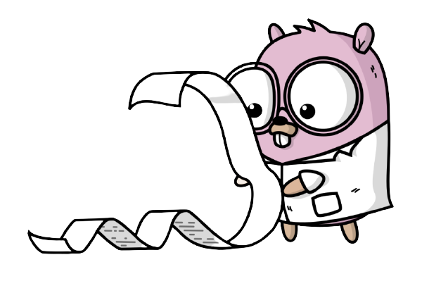

[](https://goreportcard.com/report/github.com/chen-keinan/go-license-discovery)
[](https://github.com/chen-keinan/go-license-discovery/blob/master/LICENSE)

[](https://gitter.im/beacon-sec/community?utm_source=badge&utm_medium=badge&utm_campaign=pr-badge)

<br><br>
# go-license-discovery

The license discovery is an open-source lib that can analyze license text to determine what type of
license it contains.

It searches for license texts in a file and compares them to an archive of known licenses This library encapsulate logic
from 2 best licenses detection libraries :

License Classifier : https://github.com/google/licenseclassifier

go-license-detector : https://github.com/src-d/go-license-detector

In Addition, this library uses :
checksum-based cache to have better performance detection of licenses which already been met analyzed pom file to detect
licenses which presented in the pom as a comment.

* [Installation](#installation)
* [Supported Licenses](#supported-licenses)
* [Usage](#usage)

## Installation

```shell
go get github.com/chen-keinan/go-license-discovery
```

## Supported Licenses

- License.txt
- License.md
- License within pom file comments
- Copyright
- Multi license file

## Usage :

### Copy licenses.db file:

```shell
copy licenses.db (located under pkg/matcher/licenses/licenses.db) file to <licenses folder>
```

### Extract License from pom file comments

```go
func main() {
    lm, err := matcher.NewLicenseMatcher("/licenses/")
        if err != nil {
	        fmt.Print(err.Error())
	}
    lic:=lm.matcher.GetPomCommentLicense(pomFile)
    fmt.Print(lic)
  }
```

### Example:

```go
import (
	"fmt"
	"github.com/chen-keinan/go-license-discovery/matcher"
)

func main() {
	lm, err := matcher.NewLicenseMatcher("/licenses/")
	if err != nil {
		fmt.Print(err.Error())
	}
	matchedLicenses:=lm.MatchLicenseTxt("LICENSE.md")
	fmt.Print(matchedLicenses)
}
```
